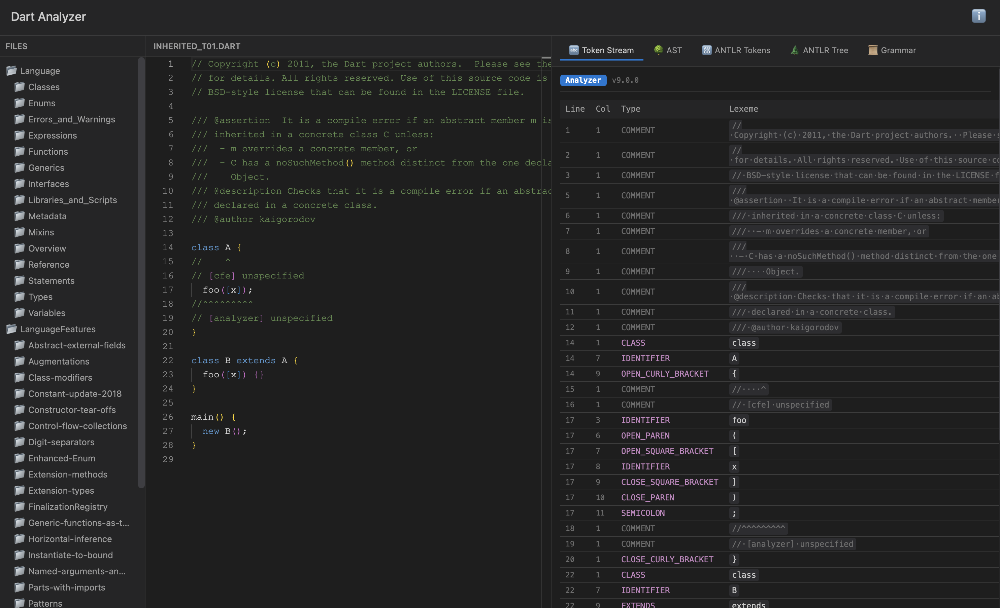

# Dart Analyzer Web

A browser-based tool for exploring Dart code structure. View tokens, AST, and more - all running client-side using the Dart analyzer package compiled to JavaScript.



## Features

- **Monaco Editor** - Full-featured code editor with Dart syntax highlighting
- **Token Stream** - View all lexical tokens with type, lexeme, and location
- **AST Viewer** - Interactive Abstract Syntax Tree explorer with collapsible nodes

## Live Demo

Visit [https://modulovalue.github.io/dart-analyzer-web/](https://modulovalue.github.io/dart-analyzer-web/)

## Technology

- Built with Dart, compiled to JavaScript using dart2js
- Uses the official [analyzer](https://pub.dev/packages/analyzer) package
- Monaco Editor for code editing
- No server required - everything runs in the browser

## Development

### Prerequisites

- [FVM](https://fvm.app/) (Flutter Version Management)

### Build

```bash
# Get dependencies
fvm dart pub get

# Update analyzer version (reads from pubspec.lock)
fvm dart run tool/update_version.dart

# Compile to JavaScript
fvm dart compile js docs/main.dart -o docs/main.dart.js

# Serve locally (any static server works)
cd docs && python3 -m http.server 8080
```

### Project Structure

```
lib/
  src/
    app.dart              # Main application
    plugin.dart           # Plugin interface
    plugins/
      token_stream_plugin.dart  # Token viewer
      ast_plugin.dart           # AST viewer
docs/
  index.html             # HTML shell
  styles.css             # Styling
  main.dart              # Entry point
  main.dart.js           # Compiled output
```

## License

MIT License
